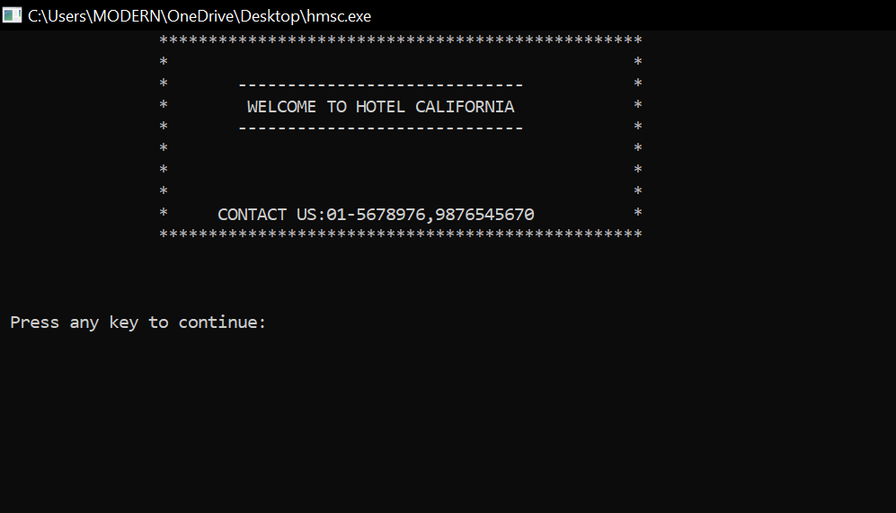
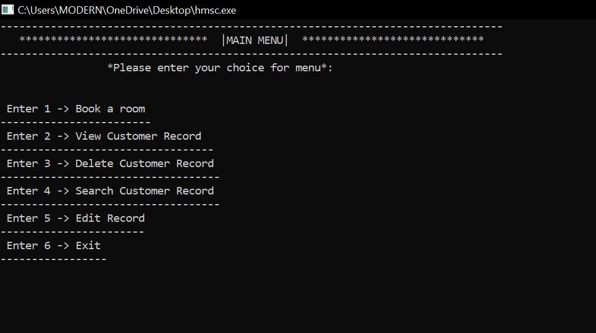

# HotelManagementSystem

This is a simple console-based Hotel Management System written in C. It allows users to perform various operations such as booking a room, viewing customer records, deleting customer records, searching for customer records, and editing customer records.

## Features

- **Login System:** Users need to log in with a predefined username and password ("user" and "pass" respectively) to access the main menu.
- **Booking a Room:** Users can add customer details, including room number, name, address, phone number, nationality, email, period of stay, and arrival date.
- **View Customer Records:** Displays a list of all customer records with details such as room number, name, address, phone number, nationality, email, period of stay, and arrival date.
- **Delete Customer Record:** Allows the deletion of a customer record based on the room number.
- **Search Customer Record:** Enables users to search for a customer record by room number.
- **Edit Customer Record:** Allows users to edit the details of a customer record based on the room number.

## Usage

1. Compile the code using a C compiler.
2. Run the compiled executable.
3. Log in with the provided username ("user") and password ("pass").
4. Use the menu options to perform different operations.

## File Storage

Customer records are stored in a file named "add.txt." The program reads from and writes to this file to maintain customer data.

## Note

- The login credentials (username and password) are hardcoded in the code for simplicity and demonstration purposes. In a real-world scenario, a more secure authentication mechanism should be implemented.

Feel free to use, modify, and contribute to this project! If you encounter any issues or have suggestions, please create an issue or pull request on GitHub.
